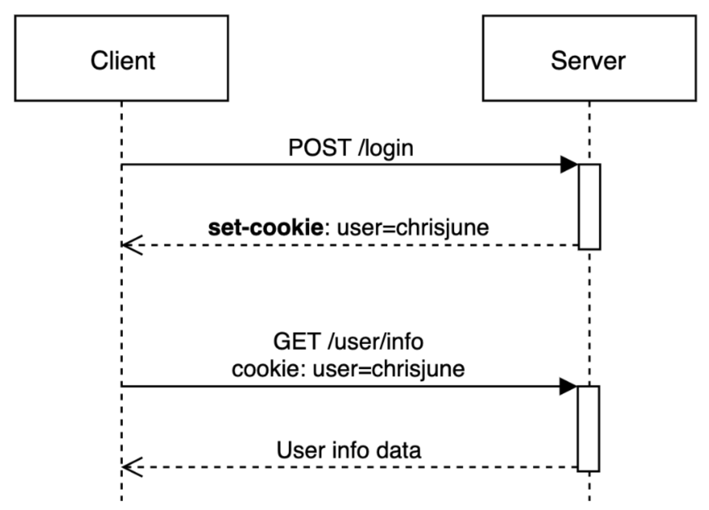
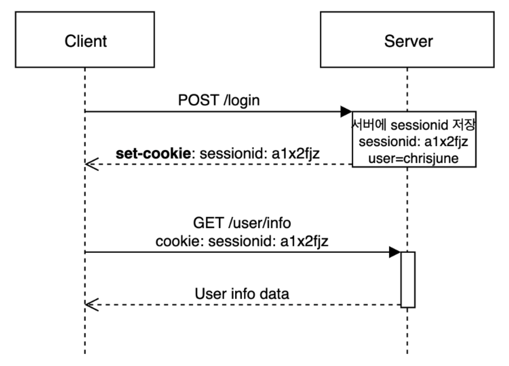

# JWT, 쿠키, 세션

## 인증(Authentication)
> - 유저가 실제 유저인지 인증하는 개념
> - 사용자의 신원을 검증하는 프로세스
> - ID, PW로 로그인하는 행위

## 인가(Authorization)
> 인증 이후 프로세스로, 인증된 유저가 어떠한 자원에 접근할 수 있는 지 확인하는 절차

관리자는 관리자 페이지에 접근 가능

## 웹 어플리케이션 인증 방식

- 웹은 서버 - 클라이언트 구조로 되어있음
- HTTP 프로토콜은 **비연결성 & 무상태**를 특수성으로 가짐 → 로그인 통해 인증을 하더라도, 이후 요청에 대해 인증 상태 유지 X
- 서버는 로그인 유무 정보를 저장 X → 반복적으로 ID, PW를 입력하여 접근 인가 받아야 함

추가적으로 로그인을 하지 않아도, 페이지에 접근할 수 있으려면?

## 쿠키(Cookie) & 세션(Session)

- **사용 목적** : HTTP 프로토콜의 약점(비연결지향 & 무상태)를 보완하기 위해 사용함

- **쿠키(Cookie)** : HTTP의 일종으로 사용자가 어떤 웹 사이트를 방문할 경우, 해당 사이트가 사용하고 있는 서버에서 사용자의 컴퓨터에 저장하는 작은 기록 정보 파일
  - **작동 방식** : 
    - 1. 클라이언트가 서버에 로그인 요청
    - 2. 서버는 클라이언트 로그인 요청의 유효성을 확인하고 응답헤더에 set-cookie를 통해 쿠키를 추가하여 응답
    - 3. 클라이언트는 이후 서버에 요청할 때 전달받은 쿠키를 자동으로 요청헤더에 추가하여 요청함.
  - 쿠키의 기한은 정해져있지 않고, 명시적으로 지우지 않는다면, 반 영구적으로 쿠키가 남아있음
  - <u>클라이언트에서 쿠키를 수정할 수 있기에 위/변조의 위험이 존재함</u>, 따라서 쿠키값을 암호화해야 하며, 민감한 정보 포함X

- **세션(Session)** : 일정 시간 동안 같은 사용자로부터 들어오는 일련의 요구를 하나의 상태로 보고, 그 상태를 유지시키는 기술
  - **작동 방식** : 
    - 1. 클라이언트가 서버에 로그인 요청
    - 2. 서버는 클라이언트의 로그인 요청의 유효성을 확인하고, unique한 id를 session ID로 생성하여 저장
    - 3. 서버가 응답할 때 응답헤더에 세션 ID를 쿠키에 추가하여 응답
    - 4. 클라이언트는 이후 서버에 요청할 때 전달받은 세션 ID를 쿠키에 자동으로 요청 헤더에 추가하여 요청
    - 5. 서버에서는 요청 헤더의 세션 ID 값을 세션 저장소에서 찾아보고 유효한지 확인 후 요청 처리 및 응답
  - 쿠키에 비해 속도가 비교적 느림
  - 사용자나 다른 누군가에게 노출되면 안되는 보안적으로 중요한 정보들을 서버안에서 다루기 위해 사용

## JWT(JSON Web Token)
> - 인증에 필요한 정보들을 암호화시킨 토큰
> - JWT 토큰(Access Token)을 HTTP 헤더에 담아 서버가 클라이언트를 식별함

JWT는 <u>서버가 추가적인 사용자 정보를 저장할 필요가 없기에, 서버간 상태 공유 문제를 해결하며, 서버에 대한 부하를 낮춤</u>

### 구조
> **Header + Payload + Signature**

- **Header(헤더)**
- **Payload(페이로드)**
- **Signature(서명)**

### Access Token
> 사용자를 대신하여 보호된 리소스에 접근하는 데 사용하는 토큰

- 일반적으로 수명이 짧음(몇 분 ~ 몇 시간)
- 만약 토큰이 탈취되더라도 짧은 만료 시간이 악용될 시간을 제한함
- HTTPS를 통한 전송

### Refresh Token
> Access 토큰이 만료되었을 때, 새로운 Access 토큰을 발급받기 위해 사용되는 토큰

- 리프레시 토큰을 사용하면 사용자가 다시 로그인 하지 않고, 지속적인 세션을 유지할 수 있음
- 액세스 토큰보다 더 긴 유효기간을 가짐 (며칠 ~ 몇주 이상)
- 초기 통신 시에만 전송되며, 클라이언트 측에서 안전하게 보관해야 함 