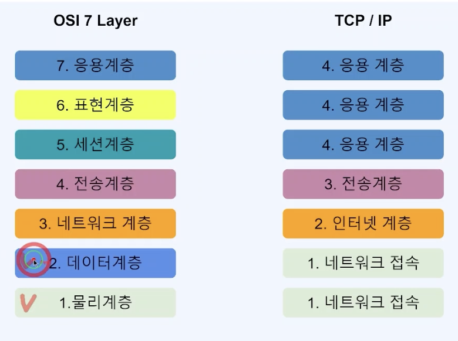

# Web과 HTTP 통신에 대해서 알아보기

## ✔️ WEB 개론

### 1️⃣ Web(World Wide Web, WWW, W3)
> 인터넷에 연결된 컴퓨터를 통해 사람들이 정보를 공유할 수 있는 전 세계적인 정보 공간

### Web의 용도

- **웹 사이트**
  - google, naver, daum, yahoo etc...
- **유저 인터페이스**
  - Chrome, Safari, Explorer, Smart Watch, IPTV 등
- **API (Application Programming Interface) Web Service**
  - Kakao Open API, Google Open API, Naver Open API etc...

### 웹의 구성요소

- **HTTP** (Hypertext Transfer Protocol)
  - 어플리케이션 컨트롤
  - GET, POST, PUT, DELETE, OPTIONS, HEAD, TRACE, CONNECT 메서드 존재
- **URI** (Uniform Resource Identifier)
  - 리소스 식별자
  - 특정 사이트, 특정 쇼핑 목록, 동영상 목록 등 웹 상에 있는 모든 정보에 접근할 수 있는 주소
  - 한 가지 리소스가 있다고 하면, 이 곳에 접근할 수 있는 주소는 여러 가지가 존재할 수 있지만, 한 개의 주소가 여러 개의 리소스를 접근할 수는 없음
- **HTML** (Hyper Text Markup Language)
  - 하이퍼미디어 포맷
  - XML을 바탕으로 한 범용 문서 포맷
  - 이를 이용하여 Chrome, Safari, Explorer에서 사용자가 알아보기 쉬운 형태로 표현

### 2️⃣ HTTP 프로토콜이란?
> HTTP(Hyper Text Transfer Protocol)로 RFC 2616에서 규정된 Web에서 데이터를 주고 받는 프로토콜 

- 이름에는 하이퍼텍스트 전송용 프로토콜로 정의되어 있음
- 하지만, 실제로는 HTML, XML, JSON, Image, Voice, Video, Javascript, PDF 등 다양한 컴퓨터에서 다룰 수 있는 것은 모두 전송 가능
- HTTP는 TCP를 기반으로 한 REST의 특징을 모두 구현하고있는 Web기반의 프로토콜

#### HTTP 메서드

| HTTP 메서드    | 의미                 | CRUD 매핑                | 멱등성 | 안정성 | Path Variable | Query Parameter | Data Body |
|-------------|--------------------|------------------------|--------|--------|-------------|---------------|----------|
| **GET**     | 리소스 조회             | Read (R)               | ✅ (항상 같은 응답) | ✅ (데이터 변경 없음) | ✅ (리소스 식별) | ✅ (필터링, 검색) | ❌ |
| **POST**    | 리소스 생성             | Create (C)             | ❌ (매 요청마다 새로운 리소스 생성 가능) | ❌ (데이터 변경 발생) | ✅ | ❌ | ✅ (새로운 리소스 데이터) |
| **PUT**     | 리소스 없으면 생성, 있으면 수정 | Create (C), Update (U) | ✅ (항상 같은 결과) | ❌ (데이터 변경 발생) | ✅ (수정할 리소스 지정) | ❌ | ✅ (전체 수정할 데이터) |
| **DELETE**  | 리소스 삭제             | Delete (D)             | ✅ (같은 요청 반복해도 동일한 결과) | ❌ (데이터 변경 발생) | ✅ (삭제할 리소스 지정) | ❌ | ❌ |
| **HEAD**    | 리소스 헤더 조회          | Read (R)               | ✅ | ✅ | ✅ | ✅ | ❌ |
| **OPTIONS** | 지원하는 메서드 조회        | -                      | ✅ | ✅ | ✅ | ✅ | ❌ |
| **TRACE**   | 요청의 경로 추적          | -                      | ✅ | ✅ | ✅ | ✅ | ❌ |
| **CONNECT** | 터널링 프로토콜           | -                      | ❌ | ❌ | ❌ | ❌ | ❌ |

#### HTTP Status Code

| 상태 코드 범위 | 의미     | 설명                                                  |
|----------|--------|-----------------------------------------------------|
| **1xx**  | 처리중    | 처리가 계속 되고 있는 상태. 클라이언트는 요청을 계속 하거나 서버의 지시에 따라서 재요청  |
| **2xx**  | 성공     | 요청의 성공                                              |
| **3xx**  | 리다이렉트  | 다른 리소스로 리다이렉트. 해당 코드를 받았을때는 Response의 새로운 주소로 다시 요청 |
| **4xx**  | 클라이언트 에러 | 클라이언트의 요청에 에러가 있는 상태. 재전송 하여도 에러가 해결되지 않는다.         |
| **5xx**  | 서버 에러  | 서버 처리중 에러가 발생한 상태. 재전송시 에러가 해결 되었을 수도 있다.           |

- **200** : 성공
- **201** : 성공, 리소스를 생성 성공
- **301** : 리다이렉트, 리소스가 다른 장소로 변경됨을 알림
- **303** : 리다이렉트, Client에서 자동으로 새로운 리소스로 요청 처리
- **400** : 요청 오류, 파라미터 에러
- **401** : 권한 없음 (인증 실패)
- **404** : 리소스 없음 (페이지를 찾을 수 없음)
- **500** : 서버 내부 에러 (서버 동작 처리 에러)
- **503** : 서비스 정지 (점검 등등)

## ✔️ REST API 개론 (Representational State Transfer, 자원의 상태 전달)

### 1️⃣ Rest 네트워크 아키텍처 원리

- **Client, Server**
  - 클라이언트와 서버가 <u>서로 독립적으로 분리되어져 있어야 한다.</u>
- **Stateless**
  - 요청에 대해서 클라이언트의 상태가 서버에 저장되지 않는다 (기억하지 않는다.)
- **캐시**
  - 클라이언트는 서버의 응답을 캐시할 수 있어야 한다.
  - 클라이언트가 캐시를 통해서 응답을 재사용할 수 있어야 하며, 이를 통해서 서버의 부하를 낮춘다.
- **계층화 (Layered System)**
  - 서버가 클라이언트 사이에 방화벽, 게이트웨이, Proxy 등 다계층 형태를 구성할 수 있어야 하며, 확장 할 수 있어야 한다.
- **인터페이스 일관성**
  - 아키텍처를 단순화시키고 작은 단위로 분리하여서, 클라이언트, 서버가 독립적으로 개선될 수 있어야 한다.
- **Code On Demand (optional)**
  - 자바 애플릿, 자바스크립트 플래시 등 특정기능을 서버가 클라이언트에 코드를 전달하여 실행 할 수 있어야 한다. 

### 인터페이스의 일관성

인터페이스 일관성이 잘 지켜졌는지에 따라 REST를 잘 사용했는지 판단을 할 수 있다.

- **자원 식별**
  - 웹 기반의 REST에서는 리소스 접근을 URI를 사용한다.
- **메시지를 통한 리소스 조작**
  - 웹에서는 다양한 방식으로 데이터를 전송할 수 있다.
  - 그 중에는 **HTML, XML, JSON, TEXT** 등 다양한 방법이 있다.
  - 이 중에서 리소스의 타입을 알려주기 위해서 header 부분에 content-type을 통해서 어떠한 타입인지를 지정할 수 있다.
- **자기 서술적 메시지**
  - 요청하는 데이터가 어떻게 처리 되어져야 하는지 충분한 데이터를 포함할 수 있어야 한다.
  - HTTP 기반의 REST에서는 HTTP Method와 Header의 정보로 이를 표현할 수 있어야 한다.
- **애플리케이션 상태에 대한 엔진으로서 하이퍼미디어**
  - REST API를 개발할 때에도 단순히 Client 요청에 대한 데이터만 내리는 것이 아닌 <u>관련된 리소스에 대한 Link 정보까지 같이 포함되어야 한다.</u>

➡️ 이러한 조건들을 잘 갖춘 경우 **REST Ful**하다고 말하고, 이를 **REST API**라고 부른다.

### 2️⃣ URI 설계

- **URI (Uniform Resource Identifier)**
  - 인터넷에서 특정 자원을 나타내는 주소 값, 해당 값은 유일하다.
  - response) sample1.pdf, sample2.pdf, sample.doc
- **URL (Uniform Resource Locator)**
  - 인터넷 상에서의 자원, 특정 파일이 어디에 위치하는지 식별하는 주소
  - ex) `https://www.foo.co.kr/sample1.pdf`

➡️ URL은 URI의 하위 개념이다.

### URI 설계원칙 (RFC-3986)

- 슬래시 구분자 (/)는 계층 관계를 나타내는 데 사용한다.
  - `https://foo.co.kr/vehicles/suv/q6`
- URI 마지막 문자로 (/)는 포함하지 않는다.
  - `https://foo.co.kr/vehicles/suv/q6/`
- 하이픈(-)은 URI 가독성을 높이는데 사용한다.
  - `https://foo.co.kr/vehicles/suv/q-series/6`
- 밑줄(_)은 사용하지 않는다.
  - `https://foo.co.kr/vehicles/suv/q_series/6`
- URI 경로에는 소문자가 적합하다.
  - `https://foo.co.kr/vehicles/suv/q6`
- 파일 확장자는 URI에 포함되지 않는다.
  - `https://foo.co.kr/vehicles/suv/q6.jsp`
- 프로그래밍 언어에 의존적인 확장자를 사용하지 않는다.
  - `https://foo.co.kr/vehicles/suv/q6.do`
- 구현에 의존적인 경로를 사용하지 않는다.
  - `https://foo.co.kr/servlet/vehicles/suv/q6`
- 세션 ID를 포함하지 않는다.
  - `https://foo.co.kr/vehicles/suv/q6?session-id=abcdef`
- 프로그래밍 언어의 Method명을 이용하지 않는다.
  - `https://foo.co.kr/vehicles/suv/q6?action=intro`
- 명사에 단수형 보다는 복수형을 사용해야 한다. 컬렉션에 대한 표현은 복수로 사용한다.
  - `https://foo.co.kr.vehicles/suv/q6`
- 컨트롤러 이름으로는 동사나 동사구를 사용한다.
  - `https://foo.co.kr/vehicles/suv/q6/re-order`
- 경로 부분 중 변하는 부분은 유일한 값으로 대체한다.
  - `https://foo.co.kr/vehicles/suv/q7/{car-id}/release`
  - `https://foo.co.kr/vehicles/suv/q7/117/users/steve/release`
- CRUD 기능을 나타내는 것은 URI에 사용하지 않는다.
  - GET : `https://foo.co.kr/vehicles/q7/delete/{car-id}` (X)
  - DELETE : `https://foo.co.kr/vehicles/q7/{car-id}` (O)
- URI Query Parameter 디자인
  - URI 쿼리 부분으로 컬렉션 결과에 대해서 필터링 할 수 있다.
    - `https://foo.co.kr/vehicles/suv?model=q7`
  - URI 쿼리는 컬렉션의 결과를 페이지로 구분하여 나타내는데 사용한다.
    - `https://foo.co.kr/vehicles/suv?page=0&size=107sort=asc`
- API에 있어서 서브 도메인은 일관성 있게 사용해야 한다.
  - `https://api.foo.co.kr`
- 클라이언트 개발자 포탈 서브 도메인은 일관성 있게 만든다.
  - `https://dev-api.foo.co.kr/vehicles/suv/q6`
  - `https://developer-api.foo.co.kr/vehicles/suv/q6`

### 3️⃣ OSI 7 Layer & TCP/IP 

어떠한 데이터를 목적지로 보내는 것이 통신의 모든 것이다.

## ✔️ Spring Boot와 Spring Web 소개

### Spring Boot 소개

Spring Boot는 단순히 실행되며, **프로덕션 제품 수준**의 스프링 기반 어플리케이션을 쉽게 만들 수 있다.

Spring Boot 어플리케이션에는 **Spring 구성이 거의 필요 하지 않다.**

Spring Boot **java -jar로** 실행하는 **Java 어플리케이션을 만들 수 있다.**

#### 주요 목표
- **Spring 개발에 대해 빠르고** 광범위하게 적용할 수 있는 환경
- **기본값 설정**이 있지만 설정을 바꿀 수 있다.
- 대규모 프로젝트에 공통적인 비 기능 제공 (**보안, 모니터링** 등등)
- **XML 구성 요구사항이 전혀 없음**

#### Build Tool
- **Maven**
- **Gradle**

#### Servlet Containers
- **Tomcat 9.0**
- **Jetty 9.4**
- **Jetty 10.0**
- **Undertow 2.0**

#### Spring Boot를 왜 사용하는지?
- 어플리케이션 개발에 필수 요소들만 모아두었다.
- 간단한 설정으로 개발 및 커스텀이 가능하다.
- 간단하고, 빠르게 어플리케이션 실행 및 배포가 가능하다.
- 대규모프로젝트(운영환경)에 필요한 비 기능적 기능도 제공한다.
- 오랜 경험에서 나오는 안정적인 운영이 가능하다.
- Spring에서 불편한 설정이 없어졌다. (XML 설정 등등)
