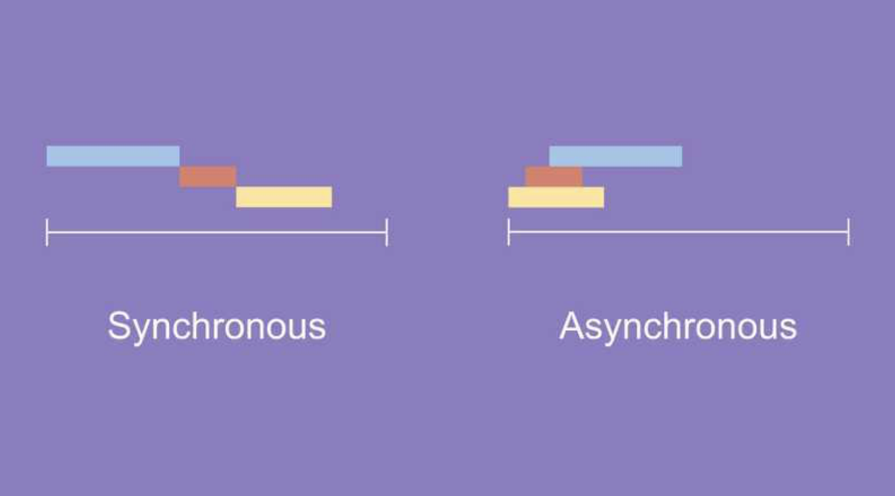

# 동기(Synchronous) & 비동기(Asynchronous)

## 동기 - 동시에 일어나는
> - 작업이 순차적으로 진행되는 것
> - 한 작업이 시작되면 해당 작업이 완료될 때까지 다른 작업이 기다려야 하는 것

호출한 함수 또는 작업이 반환될 때까지 대기하는 동안 실행 흐름이 차단된다.

각 작업의 완료를 기다리는 동안 시간이 소요됨 -> 전체 프로세스의 성능 저하

### 활용 예시

- 순차적으로 실행되어야 하는 작업 

- 작업 간의 의존성이 높은 경우

## 비동기 - 동시에 일어나지 않는
> - 작업이 독립적으로 실행되는 것
> - 작업의 완료 여부를 기다리지 않고 다른 작업을 실행할 수 있는 방식

작업이 시작되면 해당 작업이 완료될 때까지 기다리지 않고 다음 코드를 실행할 수 있다.

작업이 완료되기를 기다리는 동안 다른 작업을 처리할 수 있음 -> 전체적인 성능 향상

### 활용 예시 

I/O 작업, 네트워크 요청 등 시간이 오래 걸리는 작업 

### 구현 예시

콜백(callback), 프로미스(promise), async/await 등의 매커니즘을 통해 구현
